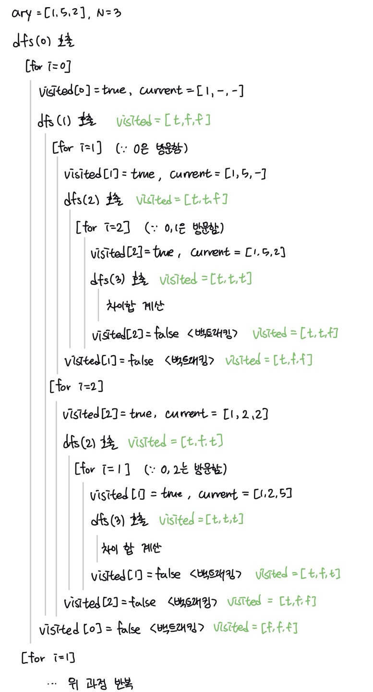

# [BOJ] 10819. 차이를 최대로
| 티어 | 유형 | 푼 언어 | 링크 |
| :-: | :-: | :-: | :-: |
|실버2|`브루트포스` `백트래킹`|c++|[BOJ 10819](https://www.acmicpc.net/problem/10819)|


## 접근 1.
처음에 설마 모든 경우를 다 해보는 거겠어 라는 생각에 좀 어렵게 접근했던 것 같다.     
근데 `n`의 최댓값이 8이라 다 돌아도 괜찮을 것 같았다.   
근데 모든 경우를 어떻게 처리할 지가 문제였다. 그래서 인터넷 뒤져보니까 `algorithm` STL에     
`next_permutation`이라는 메서드를 사용하면 된다고 해서 이걸 사용했다.   
`next_permutation`은 일단 배열이 정렬된 상태라고 가정하고 시작한다. 그래서 직접 정렬을 해줘야한다.   
버블정렬 그런거 써도 될 것 같았는데 이미 `algorithm`을 불러왔으니까 `sort`메서드 썼다.   
`do-while` 구문으로 처음 정렬된 배열에 대해 계산해보고 결과에 저장한다.     
`next_permutation`으로 다음 경우를 만든다음 다시 계산해보고, 이전 경우의 값보다 크면 결과를 덮어씌운다.    
이렇게 하면 쉽게 답이 나온다!!    
[전체코드보기](10819-1.cpp) 

```cpp
sort(ary, ary + n);

do {
    int sum = 0;
    for (int i = 0; i < n - 1; i++) {
        sum += abs(ary[i] - ary[i + 1]);
    }
    rst = rst > sum ? rst : sum;
} while (next_permutation(ary, ary + n));
```

## 접근 2.
**접근 1.** 은 너무 날먹같아서 다른 방법도 알아보았다. 뭔가 재귀함수로 풀 수 있을 것 같아서 찾아보았다.     
코드를 먼저 보는 것이 좋을 것 같다.   
[전체코드보기](10819-2.cpp)   
```cpp
void dfs(int depth) {
    if (depth == N) {
        sum_diff(); // 차이의 합을 계산하여 최댓값을 저장하는 함수
    }

    for (int i = 0; i < N; i++) {
        if (!visited[i]) {
            visited[i] = true;
            current[depth] = ary[i];
            dfs(depth + 1);
            visited[i] = false;
        }
    }
}
```
`dfs`함수는 모든 순열을 다 탐색하고 차이값을 계산하도록 되어있다.   
`N`은 입력받은 배열 `ary`의 길이, `current`는 순열을 저장하는 배열, `depth`는 현재 탐색중인 깊이이다.   
`depth == N`이 되면 순열이 완성되었다는 뜻이므로 `sum_diff`를 호출하여 차이의 합을 계산한다.   

`for`문에서 모든 순열을 탐색한다.   
방문하지 않은 숫자를 선택해서 `current[depth]`에 저장한다.   
`dfs(depth + 1)`을 호출하여 `current`의 다음 원소를 찾는다.   
탐색이 끝나면 백트래킹으로 상태를 복원한다.   
자세한 동작 과정은 다음 그림을 보자.   
