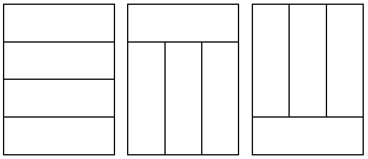
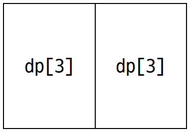
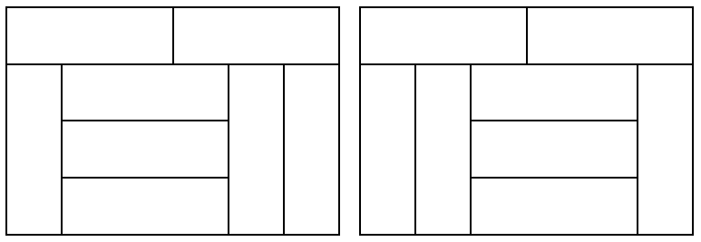
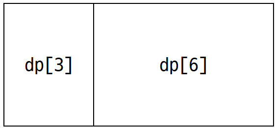

# [BOJ] 11333. 4×n 타일링
| 티어 | 유형 | 푼 언어 | 링크 |
| :-: | :-: | :-: | :-: |
|골드2|`DP`|c++|[BOJ 11333](https://www.acmicpc.net/problem/11333)|


## 접근
여지껏 푼 2xn타일링 같이 쉽게 풀릴 줄 알았는데 이해하는데 많은 시간이 걸렸다. 괜히 골드2 문제가 아니다..    
일단 n이 3의 배수가 아니면 배치할 수 없으니까 0을 출력한다.   
`dp[n] = 4xn을 채우는 방법의 수`라 하자.

#### n=3일 때
<br>
=> `dp[3]=3`   

#### n=6일 때
1) 기본 경우    
<br>
∴ `3*dp[3]`

2) 특수 경우   
<br>
일단 맨 윗줄에 3x1블록을 배치한다. <br>
아래 공간에서 양 옆에 1x3블록을 하나씩 배치하고 남은 4칸을 채우는 방법을 생각해보자. <br>
이때는 1x3블록 1개와 3x1블록 3개 쌓아올린 뭉텅이(이하 3x3블록)를 1개를 배치하는 경우밖에 없다. 따라서 2가지. <br>
맨 윗줄과 아래가 바뀌는 경우가 있으므로 x2를 해준다.   
∴ `2*2 = 4`  

∴ `dp[6] = 3*dp[3] + 4` 

#### n=9일 때
1) 기본 경우   
<br>
∴ `3*dp[6]`

2) 특수 경우   
    1) 6칸짜리 특수 경우 & 3칸    
    `4*dp[3]`

    2) 9칸짜리 특수 경우  
    이때도 n=6일 때와 비슷하게 생각해야 한다. 맨 윗줄을 먼저 3x1블록으로 채운다.   
    아래쪽 공간에서 양 옆에 1x3블록을 하나씩 배치하고 남은 7칸을 채우는 방법을 생각해보자. <br>
    이것은 1x3블록 1개, 뭉텅이블록 2개를 배치하는 것과 같다. 따라서 3가지. <br>
    마찬가지로 맨 윗줄과 아래가 바뀌는 경우가 있으므로 x2를 해준다.   
    ∴ `2*3 = 6`

∴ `dp[9] = 3*dp[6] + 4*dp[3] + 6`

#### 일반화
1) 기본 경우 : `3*dp[n-3]`
2) 특수 경우    
    1) n일 때 특수 경우    
    아래 부분의 양옆 제외 `n-2`칸을 뭉텅이블록과 1*3블록 한 개로 채워야 한다. 뭉텅이블록은 총 `n/3 -1`개 필요하다. <br>이때 경우는 `n/3`가지이고, 위아래 바뀌는 경우를 고려하면 `2*n/3`가지이다.   
    
    2) 이전의 특수 경우를 사용하는 경우    
    위를 토대로 j칸 짜리 특수 경우는 `2*j/3`임을 알 수 있다. 따라서 이전의 특수 경우를 사용하는 가짓수는    
    `∑ 2*j/3 * dp[n-j] (j=6, 9, ... , n-3)`  

    위 두가지 경우를 하나의 식으로 나타내기 위해 `dp[0]=1`이라고 하자. 그러면 특수경우에 대한 식을 다음과 같이 나타낼 수 있다.    
    `∑ 2*j/3 * dp[n-j] (j=6, 9, ... , n)`   
    모듈로 연산을 할 때 나눗셈이 있으면 곤란하므로 식을 다시 썼다.    
    `∑ 2*j * dp[n-3*j] (j=2, 3, ... , n/3)`

따라서 최종 식은 다음과 같다.
`dp[n] = 3*dp[n-3] + ∑ 2*j * dp[n-3*j] (j=2, 3, ... , n/3)`

[전체코드보기](11333.cpp)   

```cpp
dp[0] = 1;
dp[3] = 3;

for (int i = 6; i < 10001; i += 3) {
	dp[i] = (3 * (dp[i - 3] % M)) % M;
	long long temp = 0;
	for (int j = 2; j <= i / 3; j++) {
		temp = (temp + (2 % M) * (j % M) % M * (dp[i - 3 * j] % M) % M) % M;
	}
	dp[i] = (dp[i] % M + temp % M) % M;
}
```

## 참고
[[BOJ] (G2) 11333. 4 x n 타일링](https://tolerblanc.github.io/boj/boj-11333/)