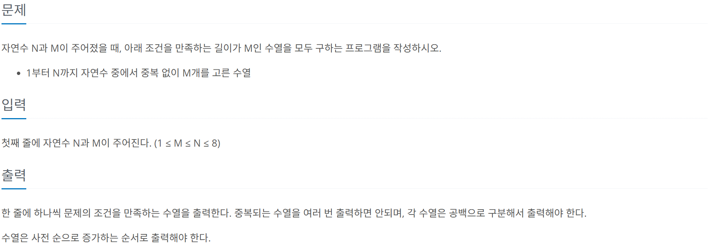

# [BOJ] 5568. 카드 놓기
| 티어 | 유형 | 푼 언어 | 링크 |
| :-: | :-: | :-: | :-: |
|실버4|`백트래킹`|python|[BOJ 5568](https://www.acmicpc.net/problem/5568)|



## 접근 1
백트래킹 문제 몇 번 풀어보니까 이제 이정도는 쉽게 풀 수 있게 됐다.   
[전체코드보기](15649-1.py)    

```python
def solve(seq):
    if (len(seq) == m):
        for num in seq:
            print(num, end=" ")
        print()
        return
    
    for i in range(0, n):
        if not used[i]:
            used[i] = True
            solve(seq + [i+1])
            used[i] = False
```
`seq`는 수열을 저장해둔 배열이다. [5568. 카드놓기](../5568.%20카드%20놓기/README.md)랑 거의 똑같은 동작 방식이다.

## 접근 2.
어떻게 하면 최적화를 할 수 있을 지 생각해봤다.   
[전체코드보기](15649-2.py)    

```python
def solve(depth):
    if depth == m:
        print(" ".join(map(str, seq))) 
        return
    
    for i in range(1, n + 1):
        if i not in used:
            used.add(i)
            seq.append(i)
            solve(depth + 1)
            seq.pop()
            used.remove(i)
```

`used`를 배열 대신 집합으로 사용하면 더 빠르다. 왜냐면 집합에서 포함 여부를 확인하는 연산이 O(1)이기 때문이다.   
그리고 함수에서 배열을 전달받는 대신 `depth`를 받아서 비교한다. [10819. 차이를 최대로](../10819.%20차이를%20최대로/README.md)의 **접근 2.** 와 동일한 방식이다.   
   
사실 이 문제는 파이썬의 `itertools`모듈에서 제공하는 `permutation`을 사용하면 아주 빠르게 풀 수 있지만   
백트래킹을 공부하고 싶어서 이렇게 풀었다. 