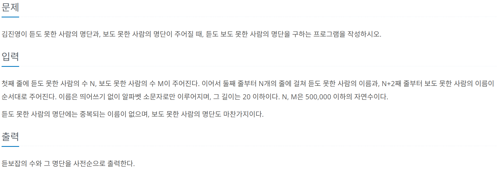

# [BOJ] 1764. 듣보잡
| 티어 | 유형 | 푼 언어 | 링크 |
| :-: | :-: | :-: | :-: |
|실버4|`자료구조`|c++|[BOJ 1764](https://www.acmicpc.net/problem/1764)|



## 접근
`n`, `m`의 범위가 `500,000`씩이나 해서 딱봐도 반복문으로 돌리면 시간초과 날 것 같았다.    
파이썬이라면 집합을 쓰면 될 것 같았는데 난 c++로 풀고싶었다.    
그래서 인터넷을 뒤져보니, c++에도 `map`이라는 컨테이너가 있었다. 이것은 `<map>`헤더에 있다.
파이썬과 비교하자면 `map` 컨테이너는 딕셔너리와 비슷하다. 차이점은 `key`값에 대해 자동으로 정렬해준다.          \
[전체코드보기](1764.cpp)   

### `map` 컨테이너 사용법
- 선언하기 : `map<자료형(key), 자료형(value)> 이름`;
- `map` 컨테이너는 존재하지 않는 `key`에 접근하려고 하면 새로 만들고 기본값으로 초기화한다. `int`형의 경우는 `0`이다.    
- `map` 컨테이너는 그냥 순회하기가 안 되기에 반복자를 선언해줘야 한다.

### 반복자 사용법
- 반복자 선언하기 : `컨테이너<자료형, 자료형, ...>::iterator 이름;`
    - 컨테이너 : 같은 타입의 여러 객체를 저장할 수 있는 묶음 단위의 데이터 구조
    - `map`도 하나의 컨테이너이다.
- 값에 접근하기 : 역참조 연산자 `*` 이용하기 또는 `->`이용하기
    - 첫 번째 요소를 가리키는 반복자 : `.begin()`
    - 마지막 요소를 가리키는 반복자 : `.end()`

`map`과 반복자를 사용해서 문제를 풀 수 있게 됐다.     
`map`을 `<string, int>`로 구성한다. `key`는 이름, `value`는 등장 횟수이다.    
입력받은 값을 `map`에 넣어준다. 그리고 `value`값을 1 증가시킨다.     
이렇게 하면 처음 등장한 이름은 `value`가 1이고, 두 번째 등장한 이름은 `value`가 2가 된다.    
`value`값이 2라면 cnt값을 늘려서 개수를 센다.    
입력을 다 받으면 처음부터 끝까지 순회하며 `value`값이 2인 `key`들을 출력한다.

```cpp
map<string, int> m;
map<string, int>::iterator iter;

for (int i = 0; i < N + M; i++) {
    cin >> s;
    m[s]++;
    if (m[s] == 2) cnt++;
}

cout << cnt << endl;

for (iter = m.begin(); iter != m.end(); iter++) {
    if (iter->second == 2) {
        cout << iter->first << endl;
    }
}
```
