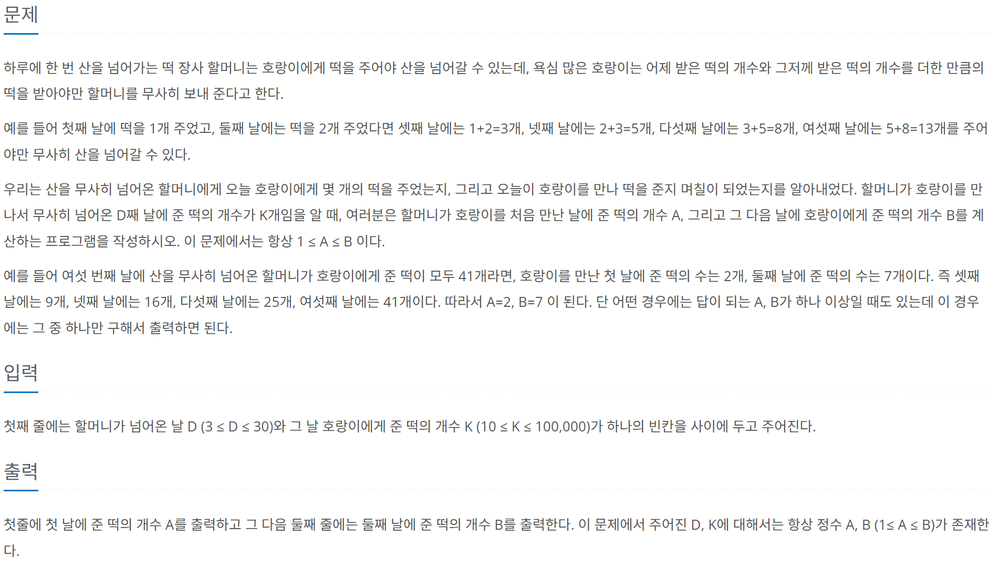

# [BOJ] 2502. 떡 먹는 호랑이
| 티어 | 유형 | 푼 언어 | 링크 |
| :-: | :-: | :-: | :-: |
|실버1|`dp` `브루트포스`|c++|[BOJ 2502](https://www.acmicpc.net/problem/2502)|



## 접근
실버 1 치고는 쉽게 풀었다. dp와 브루트포스가 합쳐진 문제였다.    
먼저 피보나치 수열을 일반화 해서 떠올려봤다.    
`dp[1]=a`이고 `dp[2]=b`인 피보나치 수열에 대해 각 항을 `a`, `b`로 나타내서 어떤 규칙이 있는지 확인해봤다.    
```
dp[1]=a, dp[2]=b, dp[3]=a+b, dp[4]=a+2b, dp[5]=2a+3b, dp[6]=3a+5b, ...
```
'a'의 계수는 초항이 1, 둘째항이 0인 피보나치 수열이고, 'b'의 계수는 초항이 0, 둘째항이 1인 피보나치 수열이다.   
각 수열을 x[n], y[n]이라 하고 나열해보자.    
```
     n = 1, 2, 3, 4, 5, 6, 7, 8,  9,  ...
{x[n]} = 1, 0, 1, 1, 2, 3, 5, 8,  13, ...
{y[n]} = 0, 1, 1, 2, 3, 5, 8, 13, 21, ...
```
잘 보면 `y[n] = x[n+1]`의 관계가 성립한다.    
결국 `n≥2`일 때 `dp[n] = x[n]*a + x[n+1]*b`로 나타낼 수 있다.   
문제에서 3번째 항 부터 고려하면 되기 때문에 `n=1`일 때는 고려하지 않아도 된다.   
이제 계수를 알았기 때문에 `a`, `b` 구하기는 브루트포스로 진행하면 된다.     
`a`와 `b`의 최댓값은 떡의 개수 `k`를 각각의 계수로 나눈 값이므로 이를 이용해서 반복문을 구성한다.   
[전체코드보기](2502.cpp) 

```cpp
x[0] = 0;
x[1] = 1;
x[2] = 0;

for (int i = 3; i < d + 2; i++) {
    x[i] = x[i - 1] + x[i - 2];
}

int p = x[d];       // a의 계수
int q = x[d + 1];   // b의 계수

for (int a = 1; a <= k / p; a++) {
    for (int b = 2; b <= k / q; b++) {
        if (p*a + q*b == k) {
            cout << a << endl << b;
            return 0;
        }
    }
}
```

