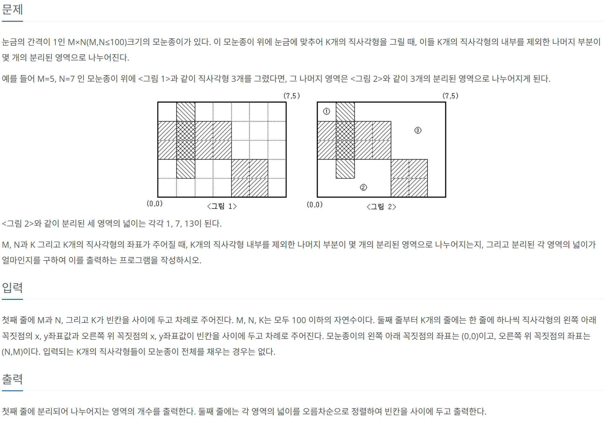

# [BOJ] 2583. 영역 구하기
| 티어 | 유형 | 푼 언어 | 링크 |
| :-: | :-: | :-: | :-: |
|브론즈1|`BFS`|c++|[BOJ 2583](https://www.acmicpc.net/problem/2583)|



## 접근
딱 봐도 BFS문제였다. 근데 BFS에서 사용하는 큐를 어떻게 써야할 지 몰랐고, 이차원 배열에 접근할 때 좌표를 써야하는데 c++에서    
튜플을 어떻게 써야할 지도 몰랐다.    
인터넷좀 뒤져보니까 c나 c++에서는 `queue`라는 헤더에서 제공하고, c++에서는 `tuple`이라는 헤더에서 튜플을 사용할 수 있었다.   
[전체코드보기](2583.cpp)   
### 큐 사용법
선언하기 : `queue<자료형> 이름;`
| 메서드      | 기능          |
|:---:        |:---:            |
| `q.push(x)`   | 큐에 x 삽입    |
| `q.pop()`    | 큐의 가장 앞 요소 제거 |
| `q.front()`  | 큐의 가장 앞 요소 반환 |
| `q.back()`   | 큐의 가장 끝 요소 반환 |
| `q.empty()`  | 큐가 비어있는지 확인 (`true`/`false` 반환) |`
| `q.size()`   | 큐의 원소개수 반환 |

### 튜플 사용법
- 튜플 만들기 : `make_tuple(a, b);`   
- 튜플의 i번 째 원소 반환 : `get<i>(tup);`

위 방법들로 좌표를 튜플로 저장하는 큐를 만들 수 있다.    

```cpp
queue<tuple<int, int>> q;   // 튜플을 저장하는 큐 선언

void bfs(int x, int y) {
	board[y][x] = 1;
	area[cnt] = 1;
	q.push(make_tuple(y, x));  // 좌표를 튜플로 저장하고 큐에 넣기

	while (!q.empty()) {
		int cy = get<0>(q.front());  // 큐의 첫 번째 원소(튜플)의 첫 번째 값 반환
		int cx = get<1>(q.front());  // 큐의 첫 번째 원소(튜플)의 두 번째 값 반환

		q.pop();

		for (int i = 0; i < 4; i++) {
			int nx = cx + dx[i];
			int ny = cy + dy[i];

			if ((0 <= nx && nx < n) && (0 <= ny && ny < m) && board[ny][nx] != 1) {
				board[ny][nx] = 1;
				area[cnt]++;
				q.push(make_tuple(ny, nx));  // 새로운 좌표를 튜플로 만들어서 넣기
			}
		}
	}
}
```
