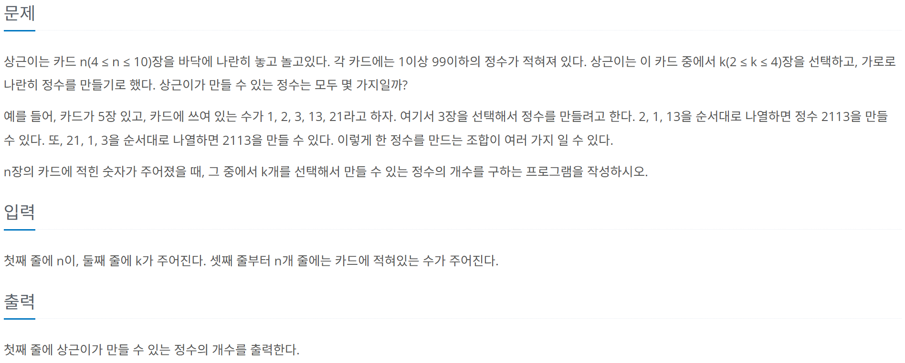

# [BOJ] 5568. 카드 놓기
| 티어 | 유형 | 푼 언어 | 링크 |
| :-: | :-: | :-: | :-: |
|실버4|`백트래킹`|python|[BOJ 5568](https://www.acmicpc.net/problem/5568)|



## 접근
백트래킹을 쓰면 되겠다는 생각을 했는데 막상 직접 짜려니까 어려웠다. 그래서 gpt의 도움을 받았다.   
[전체코드보기](5568.py)    

```python
def dfs(nums):
    if len(nums) == k:
        number = "".join(nums)
        rst.add(number)
        return 
    
    for i in range(n):
        if not used[i]:
            used[i] = True
            dfs(nums + [card[i]])
            used[i] = False
```

nums는 선택된 카드를 저장할 배열, rst는 만들어진 수를 넣을 집합, card는 입력된 카드이다.   
실행 과정은 [10819. 차이를 최대로](../10819/README.md)의 **접근 2.** 와 유사하다.    
맨 처음 `dfs`를 호출 할 때는 `nums`가 빈 리스트이다.    
사용되지 않은 수를 `nums`의 복사본에 추가해서 dfs를 다시 실행한다. (`nums + [card[i]]`)   
복사본을 사용하는 이유는 기존 선택 상태를 유지하면서 새로운 카드를 추가해 탐색하고,    
이전 상태로 복구 없이 다음 탐색을 이어갈 수 있기 때문이다.   
만약 `nums`의 카드 개수가 `k`개가 된다면 이 카드들로 숫자를 만들고 `rst`집합에 추가한다.   
집합을 사용하는 이유는 중복되는 수를 제거하기 위함이다.   